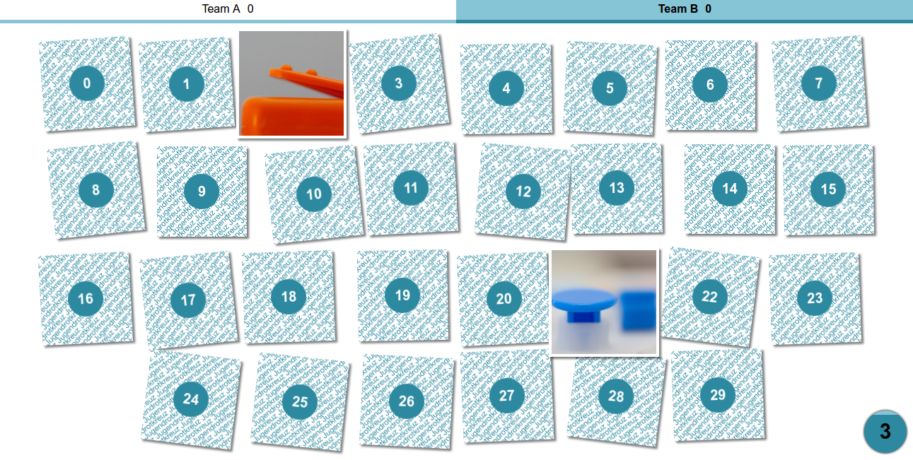

# Memory Quiz
Das Memory Quiz trainiert sowohl Gedächtnis als auch Allgemeinwissen. Nachdem ein richtiges Paar gefunden wurde, gibt es nur Punkte wenn man die entsprechende Frage richtig beantwortet.

## Installation
Nach dem [Download](https://github.com/drkTettnang/memory-quiz/archive/master.zip) einfach die Datei `index.html` mit Chrome oder Firefox öffnen.

